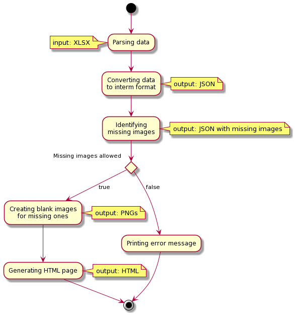

# Approach

## Background

It would be great if there would be a possibility to create a **custom dashboard**, for certain badges, a place where these badges and their receivers would be displayed.

For example, if a community uses certain badges (own or the shared community badges), they might have good use of such a dashboard, where they can present the top speaker, the top contributors, etc. Like Idea Pool, where we have our Idea Pool Presenter badge (given 131 times, has 5 levels) which can be displayed on this dashboard, by each level, displaying those profiles pictures who are on that certain level.

_Note, that there are already similar dashboards on the Heroes portal, but those are custom developments for the portal, thus cannot be used for our purpose._

## Goal

The goal of this proof-of-concept is to create a standalone solution, which:
 - displays certain badges (a given list of badges),
 - lists the people who received those badges (name, picture, title, number of the given badge)
 - displays badges per the badge levels (where it is applicable),
 - can consume data exported from **Heroes** portal (XLS, exported from Heroes Admin).

## Decisions to make

### Resources

How should we retrieve the images (badge, profile images) displayed on the dashboard?

1. **Static**: All images are saved manually as static resources.
1. **Semi-Dynamic**: All images are saved by a script on demand as static resource and the saved static resources used on the dashboard.
1. **Dynamic**: All images are used from their source (Heroes, Upsa) dynamically on the dashboard.

| Approach         | Pros.                                                                                            | Cons.                                                                                                |
|:-----------------|:-------------------------------------------------------------------------------------------------|:-----------------------------------------------------------------------------------------------------|
| **Static**       | - Quicker served static images - No need to implement authentication to Heroes/UPSA           | - Need to be updated with all new badge/people                                                       |
| **Semi-Dynamic** | - Automatically updated when necessary - Quicker served static images                         | - Need to have access to Heroes/UPSA to download                                                     |
| **Dynamic**      | - No need to save images with application - New images automatically retrieved when necessary | - Need to have live access to Heroes/UPSA to download - Depends on Heroes/UPSA to retrieve images |

#### Result

The **static** approach will be used as for the scope of the PoC, as using the respective APIs would require too much effort to implement. This would mean more manual work at the beginning (saving badge/employee images) and small works on demand.

### Data format

In what format, should we store the badge assignment data which will be displayed by the dashboard?

1. **Original**: The assignment data is stored in the original input format (XLS) and that is used during rendering.
1. **JSON**: The assignment data is stored in a convenient JSON format which is produced from the original input format, and that is used during rendering.
1. **No data**: In case of **static rendering**, there is no need for the data to be stored with the application, given that the page is already rendered from the data.

| Approach     | Pros.                                                                                                                                        | Cons.                                                                                               |
|:-------------|:---------------------------------------------------------------------------------------------------------------------------------------------|:----------------------------------------------------------------------------------------------------|
| **Original** | - No need for conversion script                                                                                                              | - Data contains too many fields - XLS is harder to handle in JS                                  |
| **JSON**     | - Much simpler, lightweight format - Can only contain the necessary fields (original + generater) - Native support in JS/TS technology | - Conversion script is necessary from the original format - No native support in Java technology |
| **No data**  | - No need to manage/store data                                                                                                               | - It only works with **static** rendering.                                                          |

#### Result

If the **static** rendering will be used, then the **No data** is the obvious choice.
Otherwise, the **JSON** format will be used to be able to manage effectively the test data.

### Synchronization

How often, and how the synchronization, actualization of the data will be done?

1. **On demand**: The assignment data is refreshed on demand, when necessary (e.g. when we know that a new badge is assigned).
1. **Scheduled**: The assignment data is refreshed on schedule, based on the badge assignment frequency (e.g. per month/week).
1. **Live**: The assignment data is retrieved when the page is loaded (with caching) and the dashboard show the current status all the time.

| Approach      | Pros.                                                   | Cons.                                                                                                                                                      |
|:--------------|:--------------------------------------------------------|:-----------------------------------------------------------------------------------------------------------------------------------------------------------|
| **On demand** | - No need to dynamically load assignment data from API  | - Need to be done manually                                                                                                                                 |
| **Scheduled** | - With proper schedule, the API is not loaded that much | - Need to be automated                                                                                                                                     |
| **Live**      | - Always actual data is displayed on the page           | - It might mean significant load to the APIs - Need to have access to Heroes API, or separate script needs to be created to retrieve data (too complex) |

#### Result

The **on demand** approach will be used as for the scope of the PoC, as the targeted badges are not assigned such often that it would require live data.

### Rendering

How should we render/display the actual dashboard page?

1. **Static**: The whole dashboard (HTML, CSS) is rendered once, per build and the static page is displayed all the time.
1. **Dynamic**: The dashboard is rendered on visit from the current assigment data set.

| Approach    | Pros.                                                                                      | Cons.                                                                           |
|:------------|:-------------------------------------------------------------------------------------------|:--------------------------------------------------------------------------------|
| **Static**  | - No need to create complex application - Can be used in multiple platforms - Faster | - Needs to be regenarated/deployed when new data arrives or any change in style |
| **Dynamic** | - Can be easily updated, improved, and fixed                                               | - Can be used in less platforms - Slower                                     |

#### Result

The **static** approach will be used as for the scope of the PoC, as the data displayed on the page will be mostly static as well. Also, this allows to deploy the dashboard mostly anywhere, or with minimal improvement.

### Technology

What technology should be used for the dashboard?

1. **JS/TS**: NodeJS server and EJS templating enginer or React/Gatsby.
1. **Java**: Java Spring application with any templating enginer.

| Approach  | Pros.                                                                                                                                    | Cons.                                                                                                            |
|:----------|:-----------------------------------------------------------------------------------------------------------------------------------------|:-----------------------------------------------------------------------------------------------------------------|
| **JS/TS** | - Quick, fast development, due to huge community and tools - Expertise is already in this technology - Native for web applications |                                                                                                                  |
| **Java**  | - Enterprise technology, with strong background and community                                                                            | - No native support for JSON - Expertise needs to be gathered beforehand - Not native for web applications |

#### Result

The **JS/TS** technology will be used, because of the already existing expertise, thus good ROI.

## Approach

The implemented PoC is based on:

- **Synchronization** is **on demand**: The assignment data is refreshed on demand, when necessary (e.g. when we know that a new badge is assigned).
- All assets and resources are **static**: All images are saved manually as static resources.
- **Rendering** is **static**: The whole dashboard (HTML, CSS) is rendered once, per build and the static page is displayed all the time.
- Final **data** is embedded in the static file, but as intermediate format **JSON** format is used: The assignment data is stored in a convenient JSON format which is produced from the original input format, and that is used during rendering.
- **Technology** is **JS/TS**: NodeJS server and EJS templating engine.

